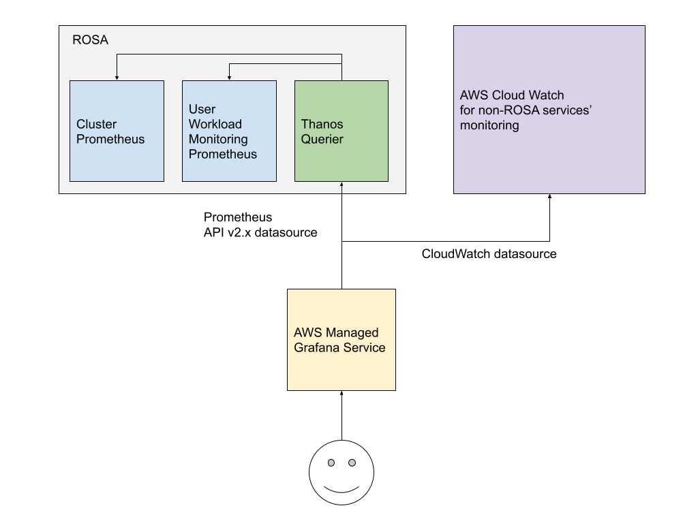

# Configuring Amazon Grafana with Thanos Querier datasource

**Anton Nesterov**

*14/07/2022*

This guide is a proof of concept for connecting AWS Managed Grafana (AMG) directly to the Thanos Querier endpoint in ROSA.

## Introduction



Thanos Querier is deployed by default with every OpenShift cluster, including ROSA. It aggregates metrics from both the Cluster Prometheus and the User Workload Monitoring Prometheus, allowing for metrics correlation across the two. Thanos Querier is [fully compatible with Prometheus 2.x API](https://thanos.io/tip/components/query.md/) and therefore can be added to Grafana as a Prometheus data source.

While users can deploy and support their own Grafana instances anywhere, it's rather convenient to make use of the AWS Managed Grafana service. This way all components of such a solution are supported and managed by a vendor: the monitoring stack withing OpenShift is managed by Red Hat as part of ROSA, while the AMG is a managed offering from AWS.

This solution may not be suitable for customers that seek to export the metrics outside of the clusters.

### Benefits

* Supported and managed by a vendor
  * ROSA and its default monitoring stack by Red Hat
  * Amazon Grafana by AWS
* Can add dashboards for other AWS datasources to create a Single Pane of Glass
* Can add multiple clusters
* Can provide tenancy by limiting access per namespaces in ROSA (see [bonus-1](bonus-1-thanos-querier-tenancy))

### Drawbacks

* Not a suitable solution when metrics need to be exported and stored outside of the clusters

## Prerequisites

* [A ROSA cluster](/docs/quickstart-rosa.md)
* AWS CLI

## Set up Red Hat SSO via operator

> skip this step if you are planning to use AWS SSO (not covered in this article)

AMG supports two methods of authentication for users:

1. AWS SSO
2. SAML with any capable IdP

For this PoC we'll use SAML with Red Hat SSO installed via operator into the same ROSA cluster that we are going to monitor. For obvious reasons this cannot be considered production.

In your ROSA cluster browse to the Operator Hub and search for the Red Hat SSO operator.
Install it with default settings into some new namespace, e.g. "rhsso".

Create an instance of keycloak:

```bash
echo << EOF | oc apply -f
apiVersion: keycloak.org/v1alpha1
kind: Keycloak
metadata:
  name: keycloak
  labels:
    app: sso
  namespace: rhsso
spec:
  externalAccess:
    enabled: true
  keycloakDeploymentSpec:
    imagePullPolicy: Always
  postgresDeploymentSpec:
    imagePullPolicy: Always
  instances: 1
EOF
```

We'll manage this instance via CRDs, so there's no need to open its administration WebUI, but if you need to, you can find the `admin` password in the secret called `credential-keycloak`.

> Make sure not to edit any objects managed via CRDs manually.

## Create an AMG Workspace

### AWS Console

* In the AWS Console navigate to **Amazon Grafana** service and click "Create Workspace".
* Give it a name, e.g. `rosa_monitoring` and click "Next"
* Check the SAML option for authentication, unless you are planning to use AWS SSO (not covered here).
* Select the desired method for Permission management - "Service management" would do just fine for this PoC. Click "Next"
* In the "Data sources" section add any desired AWS datasources. This will create the necessary IAM roles for grafana to access these services. It will **not** add the datasources themselves to Grafana. If you wish to only monitor ROSA, you can leave all checkboxes blank.
* Check the "Amazon SNS" Notification channel if you wish to configure notifications from grafana (not covered in this article). Click "Next"
* Review Settings and click "Create workspace"

### AWS CLI

//TODO

## Configure the keycloak instance

### Set up the environment

```bash
GRAFANA_WORKSPACE_NAME='rosa_monitoring'
GRAFANA_WORKSPACE_ID=$(aws grafana list-workspaces --query="workspaces[?name == '"${GRAFANA_WORKSPACE_NAME}"'].id | [0]" --output text)
GRAFANA_WORKSPACE_ENDPOINT=$(aws grafana describe-workspace --workspace-id ${GRAFANA_WORKSPACE_ID} --query="workspace.endpoint" --output text)
SAML_CLIENT_ID="https://${GRAFANA_WORKSPACE_ENDPOINT}/saml/metadata"
SAML_ASSERTION_CONSUMER_URL_POST="https://${GRAFANA_WORKSPACE_ENDPOINT}/saml/acs"
SAML_REDIRECT_URI="https://${GRAFANA_WORKSPACE_ENDPOINT}/*"
SAML_USER_PASSWORD=$(pwgen -Bcy -1 14)
```

### Create a Realm, Role, User and a SAML Client

> Skip this part if you are using AWS SSO (not covered in this article)

As part of this configuration we are going to create a Role `grafanaadmin` and one User called `trytest` with password `$SAML_USER_PASSWORD` assigned with this Role.

SAML client is made with the minimally needed set of assertion attributes for this user to become Grafana admin based on `grafanaadmin` role membership.

Red Hat SSO can also act as a broker, providing the users from another IdP. See [Bonus-2](bonus-2-configure-rh-sso-as-an-idp-broker) for details.

```bash
cat << EOF | envsubst | oc apply -f
apiVersion: keycloak.org/v1alpha1
kind: KeycloakRealm
metadata:
  name: awsrealm
  labels:
    app: sso
  namespace: rhsso
spec:
  instanceSelector:
    matchLabels:
      app: sso
  realm:
    clients:
    - enabled: true
      fullScopeAllowed: true
      redirectUris:
      - 'SAML_REDIRECT_URI'
      clientId: SAML_CLIENT_ID
      defaultClientScopes:
      - role_list
      implicitFlowEnabled: false
      publicClient: false
      standardFlowEnabled: true
      protocol: saml
      attributes:
        saml.server.signature: 'false'
        saml.client.signature: 'false'
        saml.force.post.binding: 'true'
        saml_assertion_consumer_url_post: SAML_ASSERTION_CONSUMER_URL_POST
        saml.assertion.signature: 'true'
        saml.signature.algorithm: RSA_SHA256
        saml_signature_canonicalization_method: 'http://www.w3.org/2001/10/xml-exc-c14n#'
        saml.authnstatement: 'true'
        saml_name_id_format: username
      protocolMappers:
      - config:
          attribute.name: Roles
          attribute.nameformat: Basic
          friendly.name: Roles
          single: 'true'
        name: Roles
        protocol: saml
        protocolMapper: saml-role-list-mapper
      - config:
          attribute.name: mail
          attribute.nameformat: 'urn:oasis:names:tc:SAML:2.0:attrname-format:uri'
          consentRequired: 'false'
          friendly.name: email
          user.attribute: email
        name: email
        protocol: saml
        protocolMapper: saml-user-property-mapper
      - config:
          attribute.name: displayName
          attribute.nameformat: Basic
          user.attribute: displayName
        name: displayName
        protocol: saml
        protocolMapper: saml-user-attribute-mapper
      directAccessGrantsEnabled: false
    users:
      - realmRoles:
          - grafanaadmin
        credentials:
          - type: password
            value: SAML_USER_PASSWORD
        lastName: Test
        enabled: true
        emailVerified: true
        username: trytest
        firstName: Try
        email: trytest@example.org
        attributes:
          displayName:
            - Try Test
    roles:
      realm:
        - name: grafanaadmin
    id: awsrealm
    realm: awsrealm
    enabled: true
    displayName: awsrealm
EOF
```

## Configure AMG for SAML against Red Hat SSO

Set vars

```bash
KEYCLOAK_ROUTE="https://$(oc get route keycloak -n rhsso --template={{.spec.host}})"
IDP_METADATA=${KEYCLOAK_ROUTE}/auth/realms/awsrealm/protocol/saml/descriptor
```

Update the SAML config for AMG

```bash
aws grafana update-workspace-authentication --workspace-id ${GRAFANA_WORKSPACE_ID} --authentication-providers SAML --saml-configuration="assertionAttributes={email=mail,login=mail,name=displayName,role=Roles},idpMetadata={url=${IDP_METADATA}},roleValues={admin=[grafanaadmin]}"
```

## Login to Grafana

Try to open `$GRAFANA_WORKSPACE_ENDPOINT` in your browser. At the login screen pick the SAML option. You now should be seeing Red Hat SSO login/password prompt. Use `trytest` with `$SAML_USER_PASSWORD`.

Make sure you got admin privileges, e.g. you are able to add a datasource.

## Create the datasource for Thanos Querier


Create a service account for accessing monitoring data. In this case we'll use `cluster-monitoring-view` role that gives access to all metrics an all namespaces. Having some namespace is handy to store monitoring related objects - in this case the service account and its clusterrolebinding.

```bash
oc new-project monitoring-utils
oc create sa grafana-get-everything -n monitoring-utils
oc adm policy add-cluster-role-to-user cluster-monitoring-view -z grafana-get-everything -n monitoring-utils
```

Prepare the necessary parameters:

```bash
THANOS_QUERIER_ENDPOINT="https://$(oc get route -n openshift-monitoring thanos-querier --template={{.spec.host}})"
BEARER_TOKEN="Bearer $(oc sa get-token grafana-get-everything -n monitoring-utils)"
```

Login to Grafana and add a *Prometheus* datasource. Place the contents of `$THANOS_QUERIER_ENDPOINT` variable into the *URL* field. Then click *Add header* in "Custom HTTP Headers". Type `Authorization` in the "Header" field and the contents of `$BEARER_TOKEN` variable into the "Value" field.

Click "Save & test". Hopefully you see the green banner confirming success.

## Test the datasource

In Grafana navigate to "Explore" and try the following query:

```
sum(node_namespace_pod_container:container_cpu_usage_seconds_total:sum_irate{}) by (namespace)
```

If you get a colorful graph - we've successfully connected Amazon Managed Grafana to the Thanos Querier endpoint in ROSA.

## Bonus-1: Thanos Querier tenancy

//TODO

## Bonus-2: Configure RH SSO as an IdP broker

//TODO